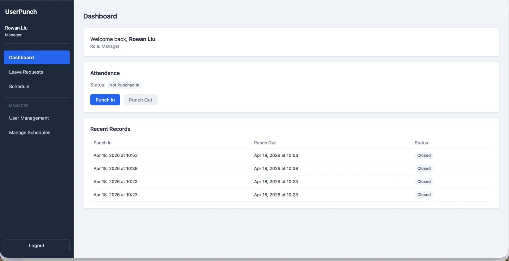
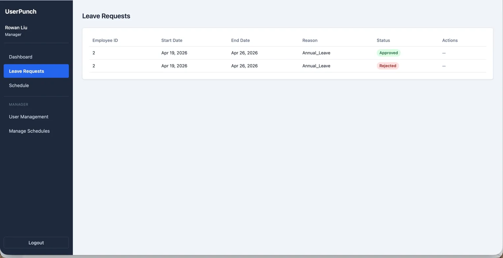
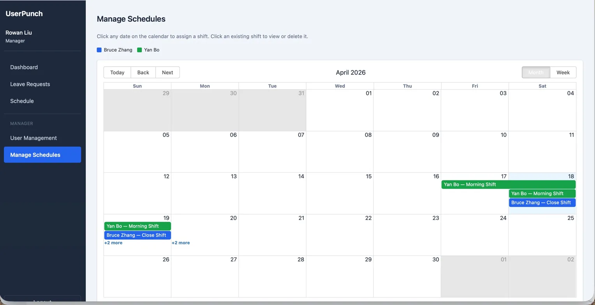
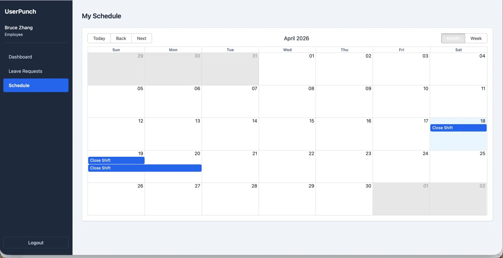
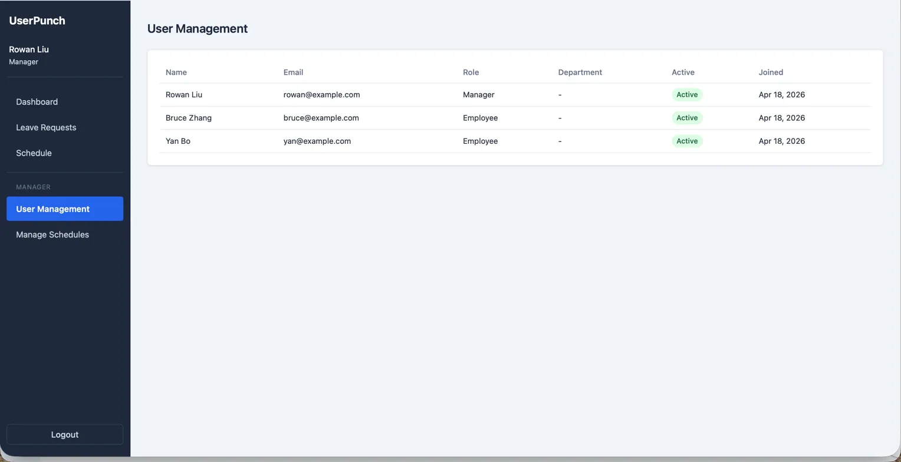

# UserPunch — Workforce Management System


A full-stack workforce management system for handling employee attendance, scheduling, and leave requests — built with **ASP.NET Core 8** and **React 19**.

---

## 📋 Project Description

UserPunch is an internal workforce management MVP designed for small-to-medium teams. It provides a clean interface for employees to clock in and out, submit leave requests, and view their schedules — while giving managers full visibility and control over the entire team.

---

## ✨ Features

### All Authenticated Users
- **Punch In / Punch Out** — clock in and out from the dashboard with live attendance status
- **Leave Requests** — submit leave requests and track approval status in real time
- **My Schedule** — view personally assigned shifts on an interactive calendar

### Managers Only
- **Manage Schedules** — assign shifts to employees via an interactive calendar (click a date to create, click a shift to delete)
- **Leave Approvals** — approve or reject pending employee leave requests
- **User Management** — view all registered users, roles, departments, and active status

---

## 📸 Screenshots

### Dashboard

> Punch in/out with live attendance status and recent punch record history.

### Leave Requests

> Managers can view all leave requests and approve or reject them directly.

### Manage Schedules

> Interactive calendar for managers to assign and manage employee shifts with colour-coded employees.

### My Schedule

> Employees see their own assigned shifts on a personal calendar view.

### User Management

> Manager-only view of all registered users, roles, and account status.

---

## 🛠 Tech Stack

### Backend
| | |
|---|---|
| Framework | ASP.NET Core 8 Web API |
| ORM | Entity Framework Core 8 |
| Database | SQLite |
| Auth | JWT Bearer (HMAC-SHA256) |
| Passwords | BCrypt |
| Docs | Swagger / OpenAPI |

### Frontend
| | |
|---|---|
| Framework | React 19 + Vite |
| Routing | React Router v7 |
| State | Zustand |
| HTTP | Axios (with auth interceptor) |
| Calendar | React Big Calendar + date-fns |
| Styles | Plain CSS with CSS variables |

---

## 📁 Project Structure

```
userPunch/
├── UserPunchApi/                  # ASP.NET Core backend
│   ├── Controllers/V1/            # Auth, Users, PunchRecords, Schedules, LeaveRequests
│   ├── Services/
│   │   ├── Interfaces/
│   │   └── Implementations/
│   ├── Repositories/
│   │   ├── Interfaces/
│   │   └── Implementations/
│   ├── Models/                    # User, PunchRecord, Schedule, LeaveRequest, Department
│   ├── Dtos/V1/                   # Input/output models per domain
│   ├── Common/                    # Roles, status constants
│   ├── Data/                      # AppDbContext
│   ├── Migrations/
│   └── Program.cs
│
└── frontend/                      # React frontend
    └── src/
        ├── api/                   # axiosClient + one file per domain
        ├── components/
        │   ├── layout/            # AppLayout, Sidebar
        │   └── common/            # ProtectedRoute, RoleRoute
        ├── pages/                 # One file per route
        ├── store/                 # authStore (Zustand)
        ├── utils/                 # token.js, formatDate.js
        └── styles/                # global.css
```

---

## 🚀 Getting Started

### Prerequisites
- .NET 8 SDK — [Download](https://dotnet.microsoft.com/download)
- Node.js 18+ — [Download](https://nodejs.org)

### 1. Clone the repo

```bash
git clone https://github.com/D7741/PunchApi.git
cd PunchApi
```

### 2. Configure the backend

Edit `UserPunchApi/appsettings.json`:

```json
{
  "Jwt": {
    "Key": "replace-with-a-strong-secret-at-least-32-chars",
    "Issuer": "UserPunchApi",
    "Audience": "UserPunchApiUsers",
    "ExpiryMinutes": 60
  }
}
```

> ⚠️ Never commit real secrets. Use `appsettings.Development.json` for local overrides.

### 3. Run the backend

```bash
cd UserPunchApi
dotnet restore
dotnet ef database update
dotnet run
```

- API: `http://localhost:5007`
- Swagger UI: `http://localhost:5007/swagger`

### 4. Run the frontend

```bash
cd frontend
npm install
npm run dev
```

- App: `http://localhost:5173`

> If Vite picks a different port, update the CORS origin in `UserPunchApi/Program.cs` to match.

### 5. Create a test account

Register via Swagger or send a POST request directly:

```json
POST http://localhost:5007/api/v1/auth/register
{
  "firstName": "Rowan",
  "lastName": "Liu",
  "email": "manager@example.com",
  "password": "Test123!",
  "role": "Manager"
}
```

> Two roles are available: `Manager` and `Employee`.

---

## 📡 API Reference

### Auth — `/api/v1/auth`
| Method | Endpoint | Access | Description |
|---|---|---|---|
| POST | `/login` | Public | Email + password → JWT |
| POST | `/register` | Public | Create account |
| GET | `/me` | Authenticated | Current user info |

### Punch Records — `/api/v1/punchrecords`
| Method | Endpoint | Access | Description |
|---|---|---|---|
| GET | `/` | Manager | All records |
| GET | `/user/{userId}` | Authenticated | Records for a user |
| POST | `/punchin` | Authenticated | Clock in |
| POST | `/punchout` | Authenticated | Clock out |

### Leave Requests — `/api/v1/leaverequests`
| Method | Endpoint | Access | Description |
|---|---|---|---|
| GET | `/` | Manager | All requests |
| GET | `/my` | Authenticated | Own requests |
| POST | `/` | Authenticated | Submit request |
| PUT | `/{id}/approve` | Manager | Approve |
| PUT | `/{id}/reject` | Manager | Reject |

### Schedules — `/api/v1/schedules`
| Method | Endpoint | Access | Description |
|---|---|---|---|
| GET | `/` | Manager | All schedules |
| GET | `/user/{userId}` | Authenticated | Schedules for a user |
| POST | `/` | Manager | Create shift |
| PUT | `/{id}` | Manager | Update shift |
| DELETE | `/{id}` | Manager | Delete shift |

### Users — `/api/v1/users`
| Method | Endpoint | Access | Description |
|---|---|---|---|
| GET | `/` | Authenticated | All users |
| GET | `/{id}` | Authenticated | User by ID |
| POST | `/` | Manager | Create user |
| PUT | `/{id}` | Manager | Update user |
| DELETE | `/{id}` | Manager | Soft delete |

---

## 🔐 Authentication

- Login returns a JWT stored in `localStorage`
- Axios automatically attaches `Authorization: Bearer <token>` on every request
- `401` responses clear the session and redirect to `/login`
- Two roles: `Employee` (default) and `Manager`
- Role-based access enforced on both backend (`[Authorize(Roles)]`) and frontend (`RoleRoute`)

---

## 🏗 Architecture

```
HTTP Request
    │
    ▼
Controller     ← validates input, extracts JWT claims
    │
    ▼
Service        ← business logic, validation rules
    │
    ▼
Repository     ← EF Core queries
    │
    ▼
AppDbContext → SQLite
```

---

## 🗺 Frontend Routes

| Route | Access | Page |
|---|---|---|
| `/login` | Public | Login |
| `/dashboard` | Authenticated | Punch in/out + recent records |
| `/leave-requests` | Authenticated | Leave request list |
| `/leave-requests/new` | Authenticated | Submit new leave request |
| `/schedule` | Authenticated | Personal shift calendar |
| `/admin/users` | Manager | User management |
| `/admin/schedules` | Manager | Schedule management calendar |

---

## 🔮 Potential Next Steps

- Refresh token rotation (DB-backed)
- Shift conflict detection
- Pagination on long lists
- Email notifications for leave approvals
- Cloud deployment (Railway + Vercel)
- Docker support

---

## 👤 Author

**Pengyu Liu**
- GitHub: [@D7741](https://github.com/D7741)

---

## 📄 License

MIT
